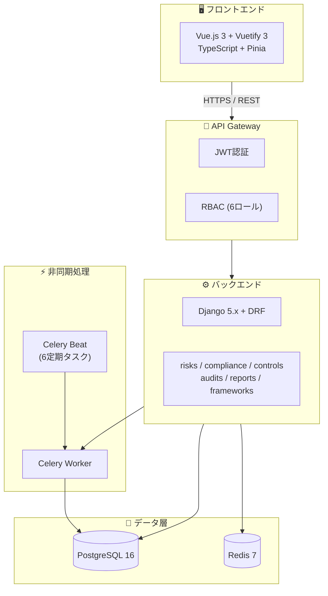
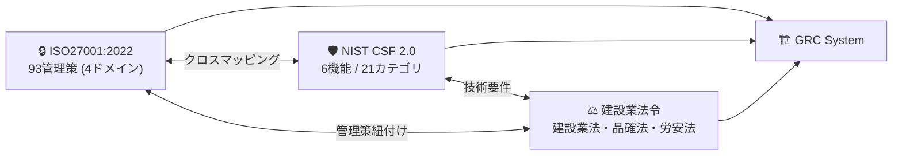
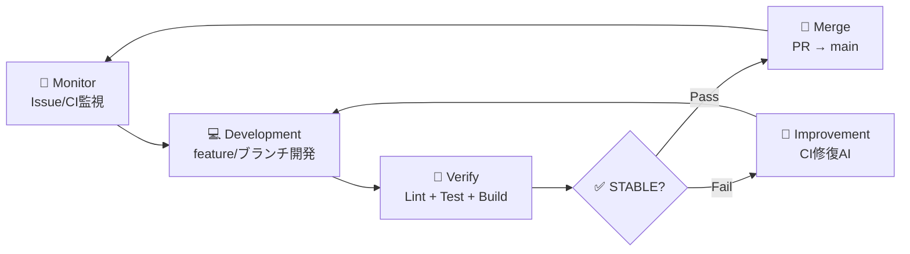

# Construction-GRC-System

## 建設業 統合リスク＆コンプライアンス管理システム

[](https://github.com/Kensan196948G/Construction-GRC-System/actions)
[](https://www.python.org/)
[](https://vuejs.org/)
[](LICENSE)
[](#-準拠規格)
[](#-準拠規格)

---

## 📊 開発状況

| Phase | 内容 | 状態 |
|:-----:|------|:----:|
| Phase 1 | 基盤構築 (Django + DRF + JWT認証 + RBAC) | ✅ 完了 |
| Phase 2 | マイグレーション + UI強化 + Celery + 監査ログ | ✅ 完了 |
| Phase 3 | フレームワークAPI + RBAC拡充 + UI3画面完全実装 | 🔄 進行中 |
| Phase 4 | 監査管理強化 + レポート生成 + 外部連携 | ⏸ 予定 |

| 指標 | 値 |
|------|-----|
| CI状態 | [](https://github.com/Kensan196948G/Construction-GRC-System/actions) |
| STABLE マージ数 | 14 PRs |
| 最終更新 | 2026-04-01 |

---

## 🚀 プロジェクト概要

**Construction-GRC-System** は、建設業向けの統合GRC（Governance, Risk, Compliance）管理基盤です。

| 項目 | 内容 |
|------|------|
| 🎯 **目的** | 多法令・多規格対応の統合GRC管理 |
| 🔒 **情報セキュリティ** | ISO27001:2022 全93管理策（4ドメイン） |
| 🛡 **サイバーセキュリティ** | NIST CSF 2.0（6機能 / 21カテゴリ） |
| ⚖️ **法令準拠** | 建設業法・品確法・労安法 |
| 👥 **利用者** | GRC管理者・リスクオーナー・監査員・経営層（約50名） |
| ⏱ **監査工数削減** | 年間500時間 → 自動化目標 |

---

## 🏗 アーキテクチャ

### システム全体構成



### フレームワーク関係図



---

## 📦 技術スタック

| カテゴリ | 技術 | バージョン |
|----------|------|-----------|
| 🐍 Backend | Python + Django + DRF | 3.12 / 5.x / 3.15 |
| 🟢 Frontend | Vue.js + TypeScript + Vuetify | 3.x / 5.x / 3.x |
| 🗄 DB | PostgreSQL | 16 |
| ⚡ Cache | Redis | 7 |
| ⏰ Task Queue | Celery + Beat | 5.x |
| 🐳 Container | Docker / Docker Compose | 24+ / 2.20+ |
| 🔄 CI/CD | GitHub Actions | - |
| 🔐 認証 | djangorestframework-simplejwt | JWT |
| 📊 レポート | openpyxl / WeasyPrint | Excel / PDF |
| 📈 チャート | Chart.js / ECharts | - |

---

## ⚙️ 機能一覧

| アイコン | 機能 | 説明 |
|:--------:|------|------|
| 🔐 | JWT認証 + RBAC | 6ロール（GRC管理者・リスクオーナー・コンプライアンス担当・監査員・経営層・一般） |
| 📋 | リスク管理 | リスクレジスター・5x5ヒートマップ・ダッシュボード・残存リスクモニタリング |
| ✅ | コンプライアンス管理 | 7法令フレームワーク対応・準拠率ダッシュボード・証跡管理 |
| 🛡 | ISO27001 全93管理策 | 適用宣言書(SoA)自動生成・4ドメイン管理（組織的37/人的8/物理的14/技術的34） |
| 📊 | NIST CSF 2.0 | 6機能（GOVERN/IDENTIFY/PROTECT/DETECT/RESPOND/RECOVER）・21カテゴリ |
| 🔍 | 内部監査管理 | 年間監査計画・監査所見(重大/軽微/観察)・是正処置(CAP)追跡 |
| 📄 | レポート生成 | PDF / Excel エクスポート・ISO27001年次レポート |
| ⚡ | 経審P点計算 | 経営事項審査P点の自動計算 |
| 🔔 | Celery定期タスク | 6タスク（リスク再評価・コンプライアンスチェック・期限通知・レポート生成等） |

---

## 🔄 開発フロー



---

## 📂 ディレクトリ構成

```
Construction-GRC-System/
├── backend/                  # Django バックエンド
│   ├── grc/                  #   プロジェクト設定 (settings, urls, wsgi)
│   ├── apps/                 #   Django アプリケーション
│   │   ├── accounts/         #     JWT認証 + RBAC + ユーザー管理
│   │   ├── risks/            #     リスク管理
│   │   ├── compliance/       #     コンプライアンス管理
│   │   ├── controls/         #     ISO27001管理策 + NIST CSF
│   │   ├── audits/           #     内部監査 + 所見管理
│   │   ├── frameworks/       #     フレームワーク定義
│   │   └── reports/          #     レポート生成
│   └── tests/                #   テスト
├── frontend/                 # Vue.js 3 フロントエンド
├── docs/                     # ドキュメント (10カテゴリ / 57ファイル)
├── scripts/                  # 自動化スクリプト
├── infrastructure/           # インフラ設定
├── .github/workflows/        # GitHub Actions CI/CD
├── Makefile                  # 開発コマンド
├── docker-compose.yml        # Docker Compose 定義
└── pyproject.toml            # Python プロジェクト設定
```

---

## 🛠 セットアップ・コマンド

### クイックスタート

```bash
git clone https://github.com/Kensan196948G/Construction-GRC-System.git
cd Construction-GRC-System
make setup          # venv作成 + 依存インストール + .env生成
make migrate        # DBマイグレーション
make fixtures       # ISO27001(93) + NIST CSF(21) + 建設業法令(17) 投入
make dev-backend    # http://localhost:8000
make dev-frontend   # http://localhost:3000
```

### Makefile コマンド一覧

| コマンド | 説明 |
|----------|------|
| `make setup` | 初期セットアップ（venv + 依存 + .env） |
| `make migrate` | DBマイグレーション |
| `make fixtures` | フィクスチャデータ投入（131レコード） |
| `make dev-backend` | バックエンド開発サーバー起動 |
| `make dev-frontend` | フロントエンド開発サーバー起動 |
| `make test` | バックエンドテスト |
| `make test-cov` | カバレッジ付きテスト |
| `make lint` | Ruff + Black チェック |
| `make lint-fix` | 自動修正 |
| `make build` | フロントエンドビルド |
| `make docker-up` | Docker Compose 起動 |
| `make docker-down` | Docker Compose 停止 |

### 管理コマンド

| コマンド | 説明 |
|----------|------|
| `python manage.py load_frameworks` | フレームワークデータ一括ロード |
| `python manage.py seed_sample_data` | 開発用サンプルリスク10件投入 |
| `python manage.py createsuperuser` | 管理者ユーザー作成 |

---

## 🔗 API エンドポイント

### 認証 (`/api/v1/auth/`)

| メソッド | パス | 説明 |
|:--------:|------|------|
| POST | `/api/v1/auth/token/` | JWTトークン取得 |
| POST | `/api/v1/auth/token/refresh/` | トークンリフレッシュ |
| GET | `/api/v1/auth/profile/` | ユーザープロフィール |
| GET | `/api/v1/auth/users/` | ユーザー一覧 |

### リスク管理 (`/api/v1/risks/`)

| メソッド | パス | 説明 |
|:--------:|------|------|
| GET/POST | `/api/v1/risks/` | リスク一覧 / 作成 |
| GET/PUT/DELETE | `/api/v1/risks/{id}/` | リスク詳細 / 更新 / 削除 |
| GET | `/api/v1/risks/heatmap/` | リスクヒートマップ |
| GET | `/api/v1/risks/dashboard/` | リスクダッシュボード |

### コンプライアンス (`/api/v1/compliance/`)

| メソッド | パス | 説明 |
|:--------:|------|------|
| GET/POST | `/api/v1/compliance/` | コンプライアンス要件一覧 / 作成 |
| GET/PUT/DELETE | `/api/v1/compliance/{id}/` | 要件詳細 / 更新 / 削除 |
| GET | `/api/v1/compliance/compliance-rate/` | 準拠率 |

### ISO27001 管理策 (`/api/v1/controls/`)

| メソッド | パス | 説明 |
|:--------:|------|------|
| GET/POST | `/api/v1/controls/` | 管理策一覧 / 作成 |
| GET/PUT/DELETE | `/api/v1/controls/{id}/` | 管理策詳細 / 更新 / 削除 |
| GET | `/api/v1/controls/soa/` | 適用宣言書(SoA) |
| GET | `/api/v1/controls/compliance-rate/` | 管理策準拠率 |
| GET/POST | `/api/v1/controls/nist-csf/` | NIST CSF カテゴリ一覧 / 作成 |
| GET/PUT/DELETE | `/api/v1/controls/nist-csf/{id}/` | NIST CSF 詳細 / 更新 / 削除 |

### 内部監査 (`/api/v1/audits/`)

| メソッド | パス | 説明 |
|:--------:|------|------|
| GET/POST | `/api/v1/audits/` | 監査一覧 / 作成 |
| GET/PUT/DELETE | `/api/v1/audits/{id}/` | 監査詳細 / 更新 / 削除 |
| GET/POST | `/api/v1/audits/findings/` | 監査所見一覧 / 作成 |
| GET/PUT/DELETE | `/api/v1/audits/findings/{id}/` | 所見詳細 / 更新 / 削除 |

### レポート (`/api/v1/reports/`)

| メソッド | パス | 説明 |
|:--------:|------|------|
| GET/POST | `/api/v1/reports/` | レポート一覧 / 作成 |
| GET/PUT/DELETE | `/api/v1/reports/{id}/` | レポート詳細 / 更新 / 削除 |

### フレームワーク (`/api/v1/frameworks/`)

| メソッド | パス | 説明 |
|:--------:|------|------|
| GET/POST | `/api/v1/frameworks/` | フレームワーク一覧 / 作成 |
| GET/PUT/DELETE | `/api/v1/frameworks/{id}/` | フレームワーク詳細 / 更新 / 削除 |

### ヘルスチェック

| メソッド | パス | 説明 |
|:--------:|------|------|
| GET | `/api/health/` | DB / Redis 接続確認 |

---

## 📋 直近の変更履歴

| PR | 内容 | 主要変更 |
|----|------|----------|
| - | Phase 3 — フレームワークAPI + RBAC拡充 + UI3画面 + CI厳格化 | ESLint v9対応, Black/isort統一, Ruff全修正 |
| #14 | Phase 2 — 初期マイグレーション全6アプリ + UI強化3画面 + APIテスト | マイグレーション追加, UI強化 |
| #13 | Celery定期タスク + 監査ログミドルウェア | 6タスク定義, 監査ログ自動記録 |
| #12 | 経営事項審査P点計算 + コンプライアンスチェッカー | 建設業法データ投入 |
| #11 | JWT認証基盤 — カスタムUser + RBAC + 認証API | 6ロール権限, トークン認証 |

---

## 📜 準拠規格

### 🔒 ISO27001:2022

全93管理策を4ドメインで管理。

| ドメイン | 管理策数 | 範囲 |
|----------|:--------:|------|
| 📋 組織的管理策 | 37 | A.5.1 〜 A.5.37 |
| 👤 人的管理策 | 8 | A.6.1 〜 A.6.8 |
| 🏢 物理的管理策 | 14 | A.7.1 〜 A.7.14 |
| 💻 技術的管理策 | 34 | A.8.1 〜 A.8.34 |

### 🛡 NIST CSF 2.0

6機能・21カテゴリによるサイバーセキュリティフレームワーク。

| 機能 | 説明 |
|------|------|
| GOVERN (GV) | ガバナンス — 組織の方針・リスク戦略 |
| IDENTIFY (ID) | 識別 — 資産・リスクの把握 |
| PROTECT (PR) | 防御 — アクセス制御・データ保護 |
| DETECT (DE) | 検知 — 異常・イベントの監視 |
| RESPOND (RS) | 対応 — インシデント対応計画 |
| RECOVER (RC) | 復旧 — 復旧計画・改善 |

### ⚖️ 建設業関連法令

| 法令 | 管轄 | 対象 |
|------|------|------|
| 建設業法 | 経営管理部 | 許可条件・経審・下請契約 |
| 品確法 | 工事部門 | 品質管理・技術継承 |
| 労安法 | 安全管理部 | 現場安全管理・労災防止 |

---

## 📄 ライセンス

[MIT License](LICENSE)

---

<div align="center">

**Construction-GRC-System**
*Building Compliance, Managing Risk, Ensuring Governance*

</div>
