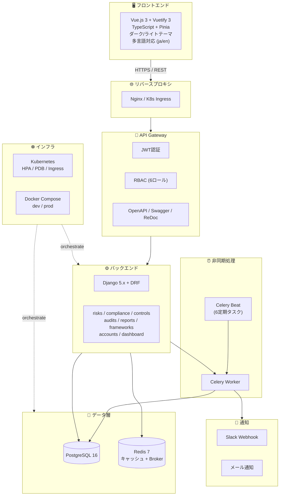
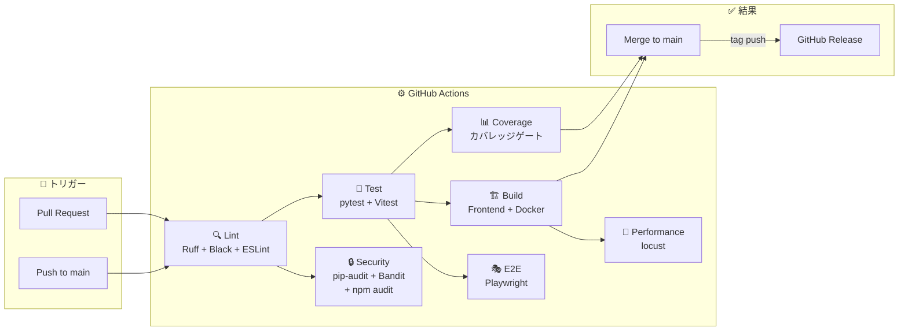
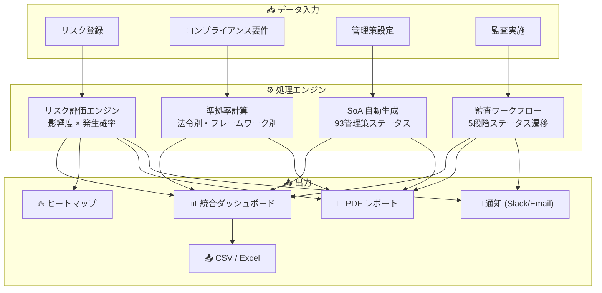
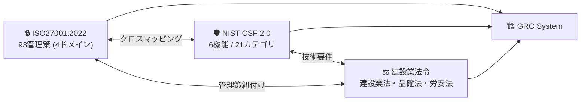

<div align="center">

# 🏗️ Construction-GRC-System

### 建設業 統合リスク＆コンプライアンス管理システム

[](https://github.com/Kensan196948G/Construction-GRC-System/actions)
[](https://www.python.org/)
[](https://www.djangoproject.com/)
[](https://vuejs.org/)
[](https://www.typescriptlang.org/)
[](https://www.postgresql.org/)
[](https://redis.io/)
[](https://docs.docker.com/compose/)
[](https://kubernetes.io/)
[](LICENSE)
[](#-iso270012022)
[](#-nist-csf-20)
[](#-テスト)
[](CHANGELOG.md)

**ISO27001全93管理策 / NIST CSF 2.0 / 建設業法・品確法・労安法 多法令準拠**

[🚀 クイックスタート](#-クイックスタート) •
[📖 API ドキュメント](#-api-エンドポイント) •
[🏗️ アーキテクチャ](#️-アーキテクチャ) •
[📋 機能一覧](#-機能一覧)

</div>

---

## 📌 プロジェクト概要

**Construction-GRC-System** は、建設業向けの統合 GRC（Governance, Risk, Compliance）管理基盤です。多法令・多規格をワンシステムで管理し、監査工数の大幅削減を実現します。

| 項目 | 内容 |
|:---:|------|
| 🎯 目的 | 多法令・多規格対応の統合GRC管理 |
| 🔒 情報セキュリティ | ISO27001:2022 全93管理策（4ドメイン） |
| 🛡️ サイバーセキュリティ | NIST CSF 2.0（6機能 / 21カテゴリ） |
| ⚖️ 法令準拠 | 建設業法・品確法・労安法 |
| 👥 利用者 | GRC管理者・リスクオーナー・監査員・経営層（約50名） |
| ⏱️ 監査工数削減 | 年間500時間 → 自動化目標 |

---

## 📸 スクリーンショット

> 📝 スクリーンショットは準備中です。以下のプレースホルダーは今後置き換えられます。

| 画面 | 説明 |
|:---:|------|
| **統合ダッシュボード** | リスク・コンプライアンス・監査 KPI を一画面に集約 |
| **リスクヒートマップ** | 5×5 リスクマトリクスによる可視化 |
| **ISO27001 管理策** | 93管理策の適用宣言書（SoA）自動生成 |
| **監査ワークフロー** | 計画→実施→レビュー→完了→クローズの5段階遷移 |

<!-- 


-->

---

## 🧰 技術スタック

| カテゴリ | 技術 | バージョン | 用途 |
|:---:|------|:---:|------|
| 🐍 Backend | Python + Django + DRF | 3.12 / 5.x / 3.15 | REST API・ビジネスロジック |
| 🖥️ Frontend | Vue.js + TypeScript + Vuetify | 3.x / 5.x / 3.x | SPA・レスポンシブUI |
| 🗄️ DB | PostgreSQL | 16 | メインデータストア |
| ⚡ Cache / Broker | Redis | 7 | キャッシュ・Celery Broker |
| ⏰ Task Queue | Celery + Beat | 5.x | 非同期処理・定期タスク |
| 🐳 Container | Docker / Docker Compose | 24+ / 2.20+ | 開発・本番コンテナ化 |
| ☸️ Orchestration | Kubernetes (HPA / PDB / Ingress) | 1.28+ | 本番オーケストレーション |
| 🔄 CI/CD | GitHub Actions | - | 自動テスト・デプロイ |
| 🔐 認証 | simplejwt + pyotp | - | JWT + TOTP 2FA |
| 📊 レポート | openpyxl / WeasyPrint | - | Excel / PDF生成 |
| 📈 チャート | Chart.js / ECharts | - | データ可視化 |
| 📚 API Docs | drf-spectacular | - | OpenAPI 3.0 自動生成 |
| 🧪 E2E | Playwright | - | エンドツーエンドテスト |
| 🚦 負荷テスト | locust | - | パフォーマンスベンチマーク |

---

## 🏗️ アーキテクチャ

### システム全体構成



### CI/CD パイプライン



### データフロー



### フレームワーク関係図



---

## 📋 機能一覧

### 🔐 認証・セキュリティ

| 機能 | 説明 |
|------|------|
| JWT認証 + RBAC | 6ロール（GRC管理者・リスクオーナー・コンプライアンス担当・監査員・経営層・一般） |
| TOTP 2FA | QRコード設定 / ワンタイムパスワード検証による二要素認証 |
| OWASP Top 10 対応 | セキュリティヘッダ・CSRF・XSS・SQLi 対策 |
| レート制限 | 匿名: 30回/分、認証済: 120回/分 |

### 📊 GRC管理

| 機能 | 説明 |
|------|------|
| リスク管理 | リスクレジスター・5×5ヒートマップ・ダッシュボード・残存リスクモニタリング |
| コンプライアンス管理 | 7法令フレームワーク対応・準拠率ダッシュボード・証跡管理 |
| ISO27001 全93管理策 | 適用宣言書(SoA)自動生成・4ドメイン管理 |
| NIST CSF 2.0 | 6機能 / 21カテゴリの完全サポート |
| 内部監査管理 | 年間計画・監査所見(重大/軽微/観察)・是正処置(CAP)追跡 |
| 監査ワークフロー | 計画中→実施中→レビュー→完了→クローズの5段階自動遷移 |

### 📈 ダッシュボード・レポート

| 機能 | 説明 |
|------|------|
| 統合GRCダッシュボード | リスク・コンプライアンス・監査の統合ビュー・KPI表示 |
| PDFレポート生成 | ISO27001年次・リスク・監査・コンプライアンスレポート |
| CSV/Excelエクスポート | 全モデル対応のデータエクスポート |
| レポートスケジュール | 日次/週次/月次の自動生成・メール配信 |
| 経審P点計算 | 経営事項審査P点の自動計算 |

### 🔧 インフラ・運用

| 機能 | 説明 |
|------|------|
| Celery定期タスク | 6タスク（リスク再評価・コンプライアンスチェック・期限通知・レポート生成等） |
| Slack / メール通知 | リスク変更・監査期限・コンプライアンス違反の即時通知 |
| Redis キャッシュ | APIレスポンスキャッシュ・N+1最適化 |
| Kubernetes 本番デプロイ | HPA / PDB / Ingress / ConfigMap / Secret 完備 |
| Docker統合テスト | CI環境スキップ可能な統合テストスイート |
| パフォーマンスベンチマーク | locust によるAPI負荷テスト |

### 🎨 UI/UX

| 機能 | 説明 |
|------|------|
| ダーク / ライトテーマ | Vuetify 3 ベースのテーマ切替 |
| 多言語対応 (i18n) | 日本語 / English 切替 |
| 9画面構成 | Dashboard / Risk / Compliance / Audit / Controls / Reports / Settings / Frameworks / ActivityLog |
| OpenAPI / Swagger / ReDoc | APIドキュメント自動生成 |

---

## 🖥️ フロントエンド画面一覧

| # | 画面 | ファイル | 説明 |
|:-:|------|----------|------|
| 1 | 📊 Dashboard | `views/Dashboard.vue` | 統合GRCダッシュボード（KPI・チャート） |
| 2 | ⚠️ Risks | `views/Risks.vue` | リスクレジスター・ヒートマップ |
| 3 | ✅ Compliance | `views/Compliance.vue` | コンプライアンス要件・準拠率 |
| 4 | 📋 Audits | `views/Audits.vue` | 内部監査・所見管理・ワークフロー |
| 5 | 🔒 Controls | `views/Controls.vue` | ISO27001管理策・SoA |
| 6 | 📄 Reports | `views/Reports.vue` | レポート生成・PDF出力 |
| 7 | ⚙️ Settings | `views/Settings.vue` | テーマ・言語・ユーザー設定 |
| 8 | 📚 Frameworks | *(予定)* | フレームワーク一覧・詳細 |
| 9 | 📜 ActivityLog | `views/ActivityLog.vue` | 変更履歴・アクティビティログ |

---

## 🚀 クイックスタート

### 前提条件

| ツール | バージョン |
|:---:|:---:|
| Python | 3.12+ |
| Node.js | 22+ |
| PostgreSQL | 16+ |
| Redis | 7+ |
| Docker / Compose | 24+ / 2.20+ |

### ローカル開発

```bash
# 1. リポジトリをクローン
git clone https://github.com/Kensan196948G/Construction-GRC-System.git
cd Construction-GRC-System

# 2. 初期セットアップ（venv作成 + 依存インストール + .env生成）
make setup

# 3. DBマイグレーション
make migrate

# 4. フィクスチャデータ投入（ISO27001: 93 + NIST CSF: 21 + 建設業法令: 17）
make fixtures

# 5. 開発サーバー起動
make dev-backend    # http://localhost:8000
make dev-frontend   # http://localhost:3000
```

### Docker Compose（開発）

```bash
make docker-up      # docker-compose.yml で起動
make docker-down    # 停止
```

### Docker Compose（本番）

```bash
docker compose -f docker-compose.prod.yml up -d    # 本番構成で起動
docker compose -f docker-compose.prod.yml down      # 停止
```

### Kubernetes デプロイ

```bash
kubectl apply -k k8s/   # Kustomize で全リソース適用
```

### 🛠️ Makefile コマンド一覧

| コマンド | 説明 |
|----------|------|
| `make setup` | 🔧 初期セットアップ（venv + 依存 + .env） |
| `make migrate` | 🗄️ DBマイグレーション |
| `make fixtures` | 📦 フィクスチャデータ投入（131レコード） |
| `make dev-backend` | 🐍 バックエンド開発サーバー起動 |
| `make dev-frontend` | 🖥️ フロントエンド開発サーバー起動 |
| `make test` | 🧪 バックエンドテスト |
| `make test-cov` | 📊 カバレッジ付きテスト |
| `make lint` | 🔍 Ruff + Black チェック |
| `make lint-fix` | 🔧 自動修正 |
| `make build` | 🏗️ フロントエンドビルド |
| `make docker-up` | 🐳 Docker Compose 起動 |
| `make docker-down` | 🐳 Docker Compose 停止 |

### 📋 管理コマンド

| コマンド | 説明 |
|----------|------|
| `python manage.py load_frameworks` | フレームワークデータ一括ロード |
| `python manage.py seed_sample_data` | 開発用サンプルリスク10件投入 |
| `python manage.py createsuperuser` | 管理者ユーザー作成 |

---

## 📡 API エンドポイント

### 🔑 認証 (`/api/v1/auth/`)

| メソッド | パス | 説明 |
|:---:|------|------|
| POST | `/api/v1/auth/token/` | JWTトークン取得 |
| POST | `/api/v1/auth/token/refresh/` | トークンリフレッシュ |
| GET | `/api/v1/auth/profile/` | ユーザープロフィール |
| GET | `/api/v1/auth/users/` | ユーザー一覧 |
| POST | `/api/v1/auth/2fa/setup/` | 🔐 TOTP 2FA設定 |
| POST | `/api/v1/auth/2fa/verify/` | 🔐 TOTP 2FA有効化 |
| POST | `/api/v1/auth/2fa/disable/` | 🔐 TOTP 2FA無効化 |

### 📊 統合ダッシュボード (`/api/v1/dashboard/`)

| メソッド | パス | 説明 |
|:---:|------|------|
| GET | `/api/v1/dashboard/` | GRC統合ダッシュボード（リスク・コンプライアンス・監査KPI） |

### ⚠️ リスク管理 (`/api/v1/risks/`)

| メソッド | パス | 説明 |
|:---:|------|------|
| GET / POST | `/api/v1/risks/` | リスク一覧 / 作成 |
| GET / PUT / DELETE | `/api/v1/risks/{id}/` | リスク詳細 / 更新 / 削除 |
| GET | `/api/v1/risks/heatmap/` | リスクヒートマップ |
| GET | `/api/v1/risks/dashboard/` | リスクダッシュボード |
| GET | `/api/v1/risks/export/csv/` | CSV エクスポート |
| GET | `/api/v1/risks/export/excel/` | Excel エクスポート |

### ✅ コンプライアンス (`/api/v1/compliance/`)

| メソッド | パス | 説明 |
|:---:|------|------|
| GET / POST | `/api/v1/compliance/` | 要件一覧 / 作成 |
| GET / PUT / DELETE | `/api/v1/compliance/{id}/` | 要件詳細 / 更新 / 削除 |
| GET | `/api/v1/compliance/compliance-rate/` | 準拠率 |
| GET | `/api/v1/compliance/export/csv/` | CSV エクスポート |
| GET | `/api/v1/compliance/export/excel/` | Excel エクスポート |

### 🔒 ISO27001 管理策 (`/api/v1/controls/`)

| メソッド | パス | 説明 |
|:---:|------|------|
| GET / POST | `/api/v1/controls/` | 管理策一覧 / 作成 |
| GET / PUT / DELETE | `/api/v1/controls/{id}/` | 管理策詳細 / 更新 / 削除 |
| GET | `/api/v1/controls/soa/` | 適用宣言書（SoA） |
| GET | `/api/v1/controls/compliance-rate/` | 管理策準拠率 |
| GET / POST | `/api/v1/controls/nist-csf/` | NIST CSF カテゴリ |
| GET | `/api/v1/controls/export/csv/` | CSV エクスポート |
| GET | `/api/v1/controls/export/excel/` | Excel エクスポート |
| GET / POST | `/api/v1/controls/evidences/` | 証跡一覧 / アップロード |

### 📋 内部監査 (`/api/v1/audits/`)

| メソッド | パス | 説明 |
|:---:|------|------|
| GET / POST | `/api/v1/audits/` | 監査一覧 / 作成 |
| GET / PUT / DELETE | `/api/v1/audits/{id}/` | 監査詳細 / 更新 / 削除 |
| POST | `/api/v1/audits/{id}/transition/` | 監査ステータス遷移 |
| GET / POST | `/api/v1/audits/findings/` | 監査所見一覧 / 作成 |
| GET | `/api/v1/audits/overdue-caps/` | 期限超過CAP一覧 |
| GET | `/api/v1/audits/upcoming-caps/` | 期限間近CAP一覧 |
| GET | `/api/v1/audits/activity-logs/` | アクティビティログ |

### 📄 レポート (`/api/v1/reports/`)

| メソッド | パス | 説明 |
|:---:|------|------|
| GET / POST | `/api/v1/reports/` | レポート一覧 / 作成 |
| POST | `/api/v1/reports/generate/risk/` | リスクレポート PDF |
| POST | `/api/v1/reports/generate/compliance/` | コンプライアンスレポート PDF |
| POST | `/api/v1/reports/generate/audit/` | 監査レポート PDF |
| POST | `/api/v1/reports/generate/iso27001/` | ISO27001年次レポート PDF |
| GET / POST | `/api/v1/reports/scheduled/` | 📅 定期レポートスケジュール |

### 📚 フレームワーク (`/api/v1/frameworks/`)

| メソッド | パス | 説明 |
|:---:|------|------|
| GET / POST | `/api/v1/frameworks/` | フレームワーク一覧 / 作成 |
| GET / PUT / DELETE | `/api/v1/frameworks/{id}/` | フレームワーク詳細 / 更新 / 削除 |

### 🏥 ヘルスチェック / APIドキュメント

| メソッド | パス | 説明 |
|:---:|------|------|
| GET | `/api/health/` | DB / Redis 接続確認 |
| GET | `/api/docs/` | Swagger UI (OpenAPI) |
| GET | `/api/redoc/` | ReDoc (OpenAPI) |
| GET | `/api/schema/` | OpenAPI 3.0 スキーマ (YAML) |

---

## 🔄 CI/CD パイプライン

GitHub Actions による7段階の自動品質ゲートを実装しています。

| # | ジョブ | 内容 | 依存 |
|:-:|:---:|------|:---:|
| 1 | 🔍 **Lint** | Ruff + Black (Python) / ESLint (Frontend) | - |
| 2 | 🧪 **Test** | pytest (Backend) + Vitest (Frontend) / PostgreSQL 16 + Redis 7 サービス | Lint |
| 3 | 📊 **Coverage** | フロントエンドカバレッジゲート + レポートアップロード | Test |
| 4 | 🏗️ **Build** | フロントエンドビルド + Docker Compose 検証 | Test |
| 5 | 🔒 **Security** | pip-audit + Bandit (Python) / npm audit (Frontend) | - |
| 6 | 🎭 **E2E** | Playwright E2E テスト（Docker Compose 起動） | Lint, Test |
| 7 | 🚦 **Performance** | locust 負荷テスト（オプション） | Build |

### 自動リリース

タグプッシュ時に GitHub Releases を自動作成（`release.yml`）。

---

## 🔒 セキュリティ

| 項目 | 実装内容 |
|------|----------|
| 🔑 認証 | JWT (access + refresh) + TOTP 2FA (pyotp) |
| 👥 認可 | RBAC 6ロール + 5権限クラス |
| 🚦 レート制限 | 匿名: 30回/分、認証済: 120回/分 |
| 🛡️ ヘッダ | CSP + Permissions-Policy + HSTS（本番） |
| 🔍 スキャン | pip-audit + Bandit + npm audit (CI統合) |
| 🧪 テスト | OWASP Top 10 テストスイート |
| 📝 監査ログ | 全変更の自動記録（ミドルウェア） |

---

## 📜 準拠規格

### 🔒 ISO27001:2022

全93管理策を4ドメインで管理。適用宣言書（SoA）の自動生成に対応。

| ドメイン | 管理策数 | 範囲 | 例 |
|----------|:---:|------|------|
| 🏢 組織的管理策 | 37 | A.5.1 - A.5.37 | 情報セキュリティ方針、役割と責任 |
| 👤 人的管理策 | 8 | A.6.1 - A.6.8 | 雇用審査、意識向上・教育 |
| 🏠 物理的管理策 | 14 | A.7.1 - A.7.14 | 物理的入退管理、装置のセキュリティ |
| 💻 技術的管理策 | 34 | A.8.1 - A.8.34 | アクセス制御、暗号化、ログ管理 |

### 🛡️ NIST CSF 2.0

6機能・21カテゴリによるサイバーセキュリティフレームワーク。

| 機能 | コード | 説明 |
|------|:---:|------|
| 🏛️ ガバナンス | GV | 組織の方針・リスク戦略 |
| 🔍 識別 | ID | 資産・リスクの把握 |
| 🛡️ 防御 | PR | アクセス制御・データ保護 |
| 👁️ 検知 | DE | 異常・イベントの監視 |
| 🚨 対応 | RS | インシデント対応計画 |
| 🔄 復旧 | RC | 復旧計画・改善 |

### ⚖️ 建設業関連法令

| 法令 | 管轄 | 対象 |
|------|------|------|
| 建設業法 | 経営管理部 | 許可条件・経審・下請契約 |
| 品確法 | 工事部門 | 品質管理・技術継承 |
| 労安法 | 安全管理部 | 現場安全管理・労災防止 |

---

## 🧪 テスト

| 指標 | 値 |
|------|:---:|
| テスト総数 | 660+ ケース |
| カバレッジ目標 | 80%以上 |
| Backend | pytest + pytest-django + factory_boy |
| Frontend | Vitest |
| E2E | Playwright (Chromium) |
| セキュリティ | OWASP Top 10 + Bandit |
| 負荷テスト | locust (10ユーザー / 60秒) |

---

## 📁 ディレクトリ構成

```
Construction-GRC-System/
├── 📂 backend/                  # Django バックエンド
│   ├── 📂 grc/                  #   プロジェクト設定 (settings, urls, wsgi)
│   ├── 📂 apps/                 #   Django アプリケーション
│   │   ├── 📂 accounts/         #     JWT認証 + RBAC + ユーザー管理
│   │   ├── 📂 risks/            #     リスク管理
│   │   ├── 📂 compliance/       #     コンプライアンス管理
│   │   ├── 📂 controls/         #     ISO27001管理策 + NIST CSF
│   │   ├── 📂 audits/           #     内部監査 + 所見管理 + ワークフロー
│   │   ├── 📂 frameworks/       #     フレームワーク定義
│   │   └── 📂 reports/          #     レポート生成 (PDF / Excel)
│   └── 📂 tests/                #   テスト (660+ ケース)
├── 📂 frontend/                 # Vue.js 3 フロントエンド
│   └── 📂 src/
│       ├── 📂 components/       #   UI コンポーネント
│       ├── 📂 views/            #   9画面
│       ├── 📂 composables/      #   テーマ・多言語・API フック
│       └── 📂 i18n/             #   多言語リソース (ja / en)
├── 📂 k8s/                      # Kubernetes マニフェスト (Kustomize)
├── 📂 e2e/                      # E2E テスト (Playwright)
├── 📂 docs/                     # ドキュメント (10カテゴリ)
├── 📂 scripts/                  # 自動化スクリプト
├── 📂 .github/workflows/        # GitHub Actions CI/CD
├── 📄 Makefile                  # 開発コマンド
├── 📄 docker-compose.yml        # Docker Compose (開発)
├── 📄 docker-compose.prod.yml   # Docker Compose (本番)
├── 📄 pyproject.toml            # Python プロジェクト設定
├── 📄 CHANGELOG.md              # 変更履歴
└── 📄 VERSION                   # バージョンファイル
```

---

## 📈 開発状況

| Phase | 内容 | 状態 |
|:---:|------|:---:|
| 1 | Django基盤 + JWT認証 + RBAC | ✅ 完了 |
| 2 | マイグレーション + UI強化 + Celery + 監査ログ | ✅ 完了 |
| 3 | フレームワークAPI + RBAC拡充 + UI3画面完全実装 | ✅ 完了 |
| 3.5+4 | テスト強化 + インフラ本番化 + ダッシュボードAPI + PDF | ✅ 完了 |
| 5 | 外部連携 + ダークテーマ + セキュリティ強化 + OpenAPI | ✅ 完了 |
| 6 | Redis + N+1最適化 + 監査自動化 + K8s + Slack + OWASP + i18n | ✅ 完了 |
| 7 | Dashboard統合 + Settings + テスト改善 | ✅ 完了 |
| 8 | CSVエクスポート + ファイルアップロード + アクティビティログ | ✅ 完了 |
| 9 | v1.0.0 リリース（最終仕上げ） | ✅ 完了 |
| 10A | Docker統合テスト + Playwright E2E + カバレッジゲート | ✅ 完了 |
| 10B | TOTP 2FA本格実装 + レポートスケジュール | ✅ 完了 |
| 10C | K8s設定スクリプト + パフォーマンスベンチマーク | ✅ 完了 |
| 11 | ScheduledReport Celery Beat + TOTP 2FA UI + モバイル対応 | ✅ 完了 |

### プロジェクト指標

| 指標 | 値 |
|:---:|:---:|
| バージョン | v1.2.0 |
| STABLE マージ数 | 50 PRs |
| テスト数 | 660+ |
| 最終更新 | 2026-04-08 |

---

## 🤝 コントリビューション

開発ルールの詳細は [CONTRIBUTING.md](CONTRIBUTING.md) を参照してください。

| ルール | 内容 |
|------|------|
| ブランチ戦略 | `feature/` ブランチで開発 → PR → CI pass → merge |
| main 直接 push | ❌ 禁止 |
| コミット | [Conventional Commits](https://www.conventionalcommits.org/) 準拠 |
| Python | Black + isort + Ruff |
| TypeScript | ESLint + Prettier |
| テストカバレッジ | 80%以上目標 |

---

## 📄 ライセンス

[MIT License](LICENSE)

---

<div align="center">

**🏗️ Construction-GRC-System**

*Building Compliance, Managing Risk, Ensuring Governance*

[](#-iso270012022)
[](#-nist-csf-20)
[](#-テスト)

</div>
