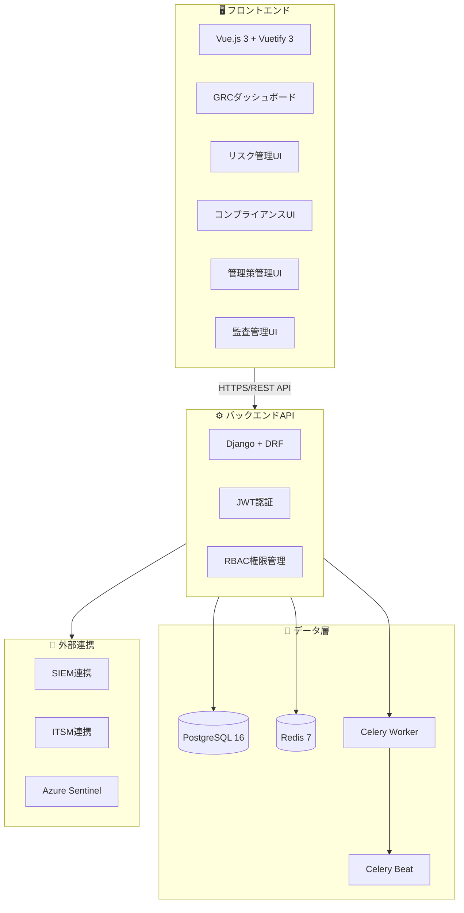
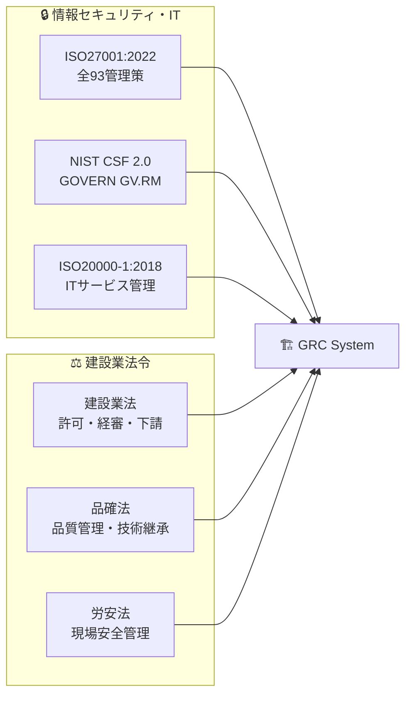
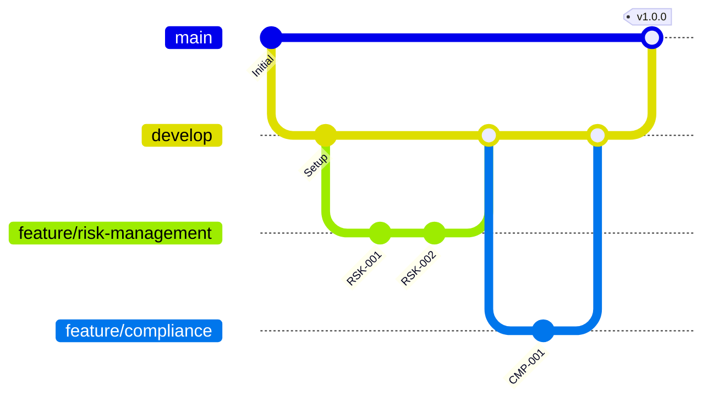
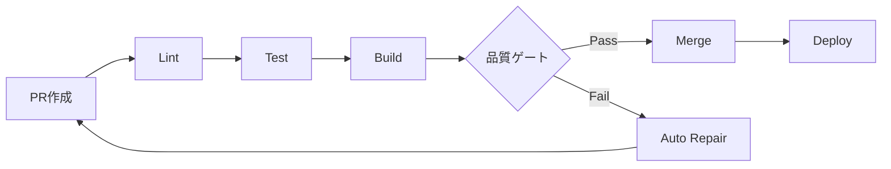
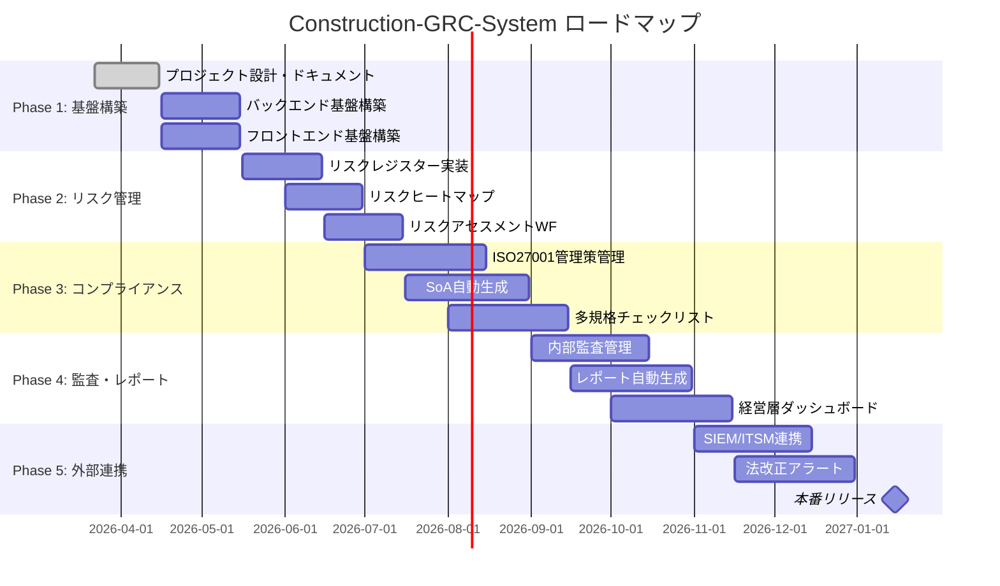

# 🏗️ Construction-GRC-System

## 建設業 統合リスク＆コンプライアンス管理システム

[](https://github.com/Kensan196948G/Construction-GRC-System/actions)
[](LICENSE)
[](#)
[](#)

> **ISO27001 全93管理策 ／ NIST CSF 2.0 ／ 建設業法・品確法・労安法**
> 多法令準拠の統合GRC（Governance, Risk, Compliance）基盤

---

## 📋 目次

- [概要](#-概要)
- [主要機能](#-主要機能)
- [システムアーキテクチャ](#-システムアーキテクチャ)
- [技術スタック](#-技術スタック)
- [準拠規格・法令](#-準拠規格法令)
- [ドキュメント構成](#-ドキュメント構成)
- [クイックスタート](#-クイックスタート)
- [開発ガイド](#-開発ガイド)
- [プロジェクトロードマップ](#-プロジェクトロードマップ)
- [ライセンス](#-ライセンス)

---

## 🎯 概要

**Construction-GRC-System** は、みらい建設工業向けに開発された統合GRC基盤です。

| 項目 | 内容 |
|------|------|
| 🏢 **組織** | みらい建設工業 IT部門 |
| 🎯 **目的** | 多法令・多規格対応の統合GRC管理 |
| 📊 **管理対象** | ISO27001 全93管理策 + NIST CSF 2.0 + 建設業関連法令 |
| 👥 **利用者** | 約50名（GRC管理者・リスクオーナー・監査員・経営層） |
| ⏱️ **監査工数削減** | 年間500時間 → 自動化目標 |

### 解決する課題

```
❌ Before                          ✅ After
─────────────────────              ─────────────────────
部門分散・属人的管理      →       全社横断的な統合管理
年1回のリスクアセスメント  →       継続的モニタリング
監査対応に500時間/年      →       自動証跡収集・レポート生成
法改正対応の遅延リスク    →       法改正アラート自動通知
```

---

## ✨ 主要機能

### 🔴 リスク管理（Risk Management）

| 機能 | 説明 |
|------|------|
| 📝 リスクレジスター | リスクの登録・評価・対応計画・ステータス管理 |
| 🗺️ リスクヒートマップ | 5×5 発生可能性×影響度マトリクス |
| 📊 残存リスクモニタリング | 四半期ごとの再評価 |
| 🏗️ 建設業特有テンプレート | 現場安全・施工品質・下請管理リスク |

### 🟢 コンプライアンス管理（Compliance）

| 機能 | 説明 |
|------|------|
| ✅ 多規格チェックリスト | ISO27001/NIST CSF/建設業法対応 |
| 📎 証跡ドキュメント管理 | バージョン管理付き証跡保管 |
| 📈 準拠率ダッシュボード | 規格別・部門別の準拠率可視化 |
| ⚖️ 法改正アラート | 関連法令の改正情報自動通知 |

### 🔵 ISO27001 管理策管理（Controls）

| 機能 | 説明 |
|------|------|
| 📋 93管理策マスタ管理 | ISO27001:2022 全管理策の実施状況 |
| 📄 適用宣言書（SoA）自動生成 | Excel/PDF形式エクスポート |
| 🔗 NIST CSF マッピング | ISO27001 ↔ NIST CSF クロスマッピング |

### 🟡 内部監査管理（Audit）

| 機能 | 説明 |
|------|------|
| 📅 年間監査計画管理 | スケジュール・担当者管理 |
| 🔍 監査所見管理 | 重大/軽微/観察事項の記録 |
| 🔧 是正処置追跡（CAP） | 是正計画の進捗・効果確認 |
| 📑 監査報告書自動生成 | ドラフト自動作成 |

### 📊 ダッシュボード・レポート

| 機能 | 説明 |
|------|------|
| 🏠 経営層GRCダッシュボード | リスク・コンプライアンスサマリ |
| 📈 リスクトレンド分析 | 推移・改善状況のトレンド |
| 📄 ISO27001年次レポート | 認証審査用レポート自動生成 |

---

## 🏛️ システムアーキテクチャ



### コンポーネント構成

```
┌─────────────────────────────────────────────────────────────┐
│                    フロントエンド層                           │
│  Vue.js 3 (Composition API) / TypeScript / Vuetify 3        │
│  ┌──────────┬──────────┬──────────┬──────────┬────────────┐ │
│  │Dashboard │  Risks   │Compliance│ Controls │   Audits   │ │
│  └──────────┴──────────┴──────────┴──────────┴────────────┘ │
└─────────────────────────┬───────────────────────────────────┘
                          │ HTTPS / REST API
┌─────────────────────────▼───────────────────────────────────┐
│                    バックエンドAPI層                          │
│  Python Django + DRF / JWT認証 / RBAC / Multi-tenant        │
│  ┌──────────┬──────────┬──────────┬──────────┬────────────┐ │
│  │  risks   │compliance│ controls │  audits  │  reports   │ │
│  └──────────┴──────────┴──────────┴──────────┴────────────┘ │
└──────┬──────────┬──────────┬──────────┬─────────────────────┘
       │          │          │          │
┌──────▼──┐  ┌───▼───┐  ┌───▼──┐  ┌───▼─────────────────┐
│PostgreSQL│  │ Redis │  │Celery│  │    外部連携          │
│  GRC DB  │  │Cache  │  │Worker│  │ SIEM / ITSM / Azure │
└─────────┘  └───────┘  └──────┘  └─────────────────────┘
```

---

## 🛠️ 技術スタック

### バックエンド

| カテゴリ | 技術 | バージョン | 用途 |
|----------|------|-----------|------|
| 🐍 言語 | Python | 3.12+ | メイン開発言語 |
| 🌐 フレームワーク | Django | 5.x | Webフレームワーク |
| 📡 API | Django REST Framework | 3.15+ | REST API |
| 🔐 認証 | djangorestframework-simplejwt | - | JWT認証 |
| 🗄️ DB | PostgreSQL | 16 | メインDB |
| ⚡ キャッシュ | Redis | 7 | キャッシュ・セッション |
| ⏰ タスク | Celery + Beat | 5.x | 非同期タスク・定期実行 |
| 📊 レポート | openpyxl / WeasyPrint | - | Excel/PDF生成 |

### フロントエンド

| カテゴリ | 技術 | バージョン | 用途 |
|----------|------|-----------|------|
| 🟢 フレームワーク | Vue.js | 3.x | UIフレームワーク |
| 🎨 UIライブラリ | Vuetify | 3.x | マテリアルデザイン |
| 📝 言語 | TypeScript | 5.x | 型安全な開発 |
| 🏪 状態管理 | Pinia | - | ストア管理 |
| 📊 チャート | Chart.js / ECharts | - | ヒートマップ・グラフ |

### インフラ・DevOps

| カテゴリ | 技術 | 用途 |
|----------|------|------|
| 🐳 コンテナ | Docker / Docker Compose | コンテナ化 |
| 🔄 CI/CD | GitHub Actions | 自動テスト・デプロイ |
| ☁️ 本番環境 | Azure (予定) | クラウドホスティング |
| 📋 プロジェクト管理 | GitHub Projects | タスク・状態管理 |

---

## ⚖️ 準拠規格・法令



| 規格・法令 | 対象範囲 | 管轄部門 | 管理策数 |
|-----------|----------|---------|---------|
| 🔒 **ISO27001:2022** | 全93管理策（4ドメイン） | IT部門 | 93 |
| 🛡️ **NIST CSF 2.0** | 6機能（GOVERN～RECOVER） | IT部門 | - |
| 📋 **ISO20000-1:2018** | ITリスク管理 | IT部門 | - |
| 🏗️ **建設業法** | 許可条件・経審・下請契約 | 経営管理部 | - |
| ✅ **品確法** | 品質管理・技術継承 | 工事部門 | - |
| ⛑️ **労安法** | 現場安全管理 | 安全管理部 | - |

### ISO27001:2022 管理策ドメイン

| ドメイン | 管理策数 | 例 |
|----------|---------|-----|
| 📋 組織的管理策 | 37 | A.5.1〜A.5.37 |
| 👤 人的管理策 | 8 | A.6.1〜A.6.8 |
| 🏢 物理的管理策 | 14 | A.7.1〜A.7.14 |
| 💻 技術的管理策 | 34 | A.8.1〜A.8.34 |

---

## 📚 ドキュメント構成

```
docs/
├── 📁 01_計画フェーズ（Planning）/
│   ├── 01_プロジェクト憲章（Project-Charter）.md
│   ├── 02_プロジェクト計画書（Project-Plan）.md
│   ├── 03_WBS（Work-Breakdown-Structure）.md
│   ├── 04_スケジュール計画（Schedule-Plan）.md
│   ├── 05_リソース計画（Resource-Plan）.md
│   ├── 06_コスト見積（Cost-Estimation）.md
│   ├── 07_リスク管理計画（Risk-Management-Plan）.md
│   ├── 08_品質管理計画（Quality-Management-Plan）.md
│   ├── 09_コミュニケーション計画（Communication-Plan）.md
│   └── 10_ステークホルダー分析（Stakeholder-Analysis）.md
│
├── 📁 02_要件定義（Requirements）/
│   ├── 01_要件定義書（Requirements-Specification）.md
│   ├── 02_機能要件一覧（Functional-Requirements）.md
│   ├── 03_非機能要件一覧（Non-Functional-Requirements）.md
│   ├── 04_ユースケース定義（Use-Case-Definitions）.md
│   ├── 05_ユーザーストーリー（User-Stories）.md
│   └── 06_受入基準（Acceptance-Criteria）.md
│
├── 📁 03_設計（Design）/
│   ├── 01_システムアーキテクチャ設計書（System-Architecture）.md
│   ├── 02_詳細設計仕様書（Detailed-Design-Specification）.md
│   ├── 03_データベース設計書（Database-Design）.md
│   ├── 04_API設計書（API-Design）.md
│   ├── 05_UI-UX設計書（UI-UX-Design）.md
│   ├── 06_セキュリティ設計書（Security-Design）.md
│   └── 07_インフラ設計書（Infrastructure-Design）.md
│
├── 📁 04_開発ガイド（Development-Guide）/
│   ├── 01_開発環境構築手順（Development-Setup）.md
│   ├── 02_コーディング規約（Coding-Standards）.md
│   ├── 03_Git運用ルール（Git-Workflow）.md
│   ├── 04_CI-CD設計書（CICD-Design）.md
│   └── 05_アーキテクチャ決定記録（Architecture-Decision-Records）.md
│
├── 📁 05_テスト（Testing）/
│   ├── 01_テスト計画書（Test-Plan）.md
│   ├── 02_テスト仕様書（Test-Specification）.md
│   ├── 03_テストケース一覧（Test-Cases）.md
│   ├── 04_パフォーマンステスト計画（Performance-Test-Plan）.md
│   └── 05_セキュリティテスト計画（Security-Test-Plan）.md
│
├── 📁 06_運用・保守（Operations）/
│   ├── 01_運用手順書（Operations-Manual）.md
│   ├── 02_監視設計書（Monitoring-Design）.md
│   ├── 03_障害対応手順書（Incident-Response）.md
│   ├── 04_バックアップ・リストア手順（Backup-Restore）.md
│   └── 05_保守計画（Maintenance-Plan）.md
│
├── 📁 07_リリース管理（Release-Management）/
│   ├── 01_リリース計画（Release-Plan）.md
│   ├── 02_リリースチェックリスト（Release-Checklist）.md
│   ├── 03_デプロイ手順書（Deployment-Guide）.md
│   ├── 04_ロールバック手順書（Rollback-Guide）.md
│   └── 05_変更管理手順（Change-Management）.md
│
├── 📁 08_GRC固有（GRC-Specific）/
│   ├── 01_ISO27001管理策マッピング（ISO27001-Controls-Mapping）.md
│   ├── 02_NIST-CSF-2.0マッピング（NIST-CSF-Mapping）.md
│   ├── 03_建設業法準拠要件（Construction-Law-Requirements）.md
│   ├── 04_品確法準拠要件（Quality-Assurance-Law）.md
│   ├── 05_労安法準拠要件（Occupational-Safety-Law）.md
│   └── 06_法令クロスリファレンス（Regulatory-Cross-Reference）.md
│
├── 📁 09_ロードマップ（Roadmap）/
│   ├── 01_プロダクトロードマップ（Product-Roadmap）.md
│   ├── 02_フェーズ別実装計画（Phase-Implementation-Plan）.md
│   ├── 03_マイルストーン定義（Milestone-Definitions）.md
│   └── 04_技術ロードマップ（Technology-Roadmap）.md
│
└── 📁 10_セキュリティ（Security）/
    ├── 01_セキュリティポリシー（Security-Policy）.md
    ├── 02_アクセス制御設計（Access-Control-Design）.md
    ├── 03_脆弱性管理計画（Vulnerability-Management）.md
    └── 04_インシデント対応計画（Incident-Response-Plan）.md
```

---

## 🚀 クイックスタート

### 前提条件

| ツール | バージョン |
|--------|-----------|
| 🐍 Python | 3.12+ |
| 🟢 Node.js | 20+ |
| 🐳 Docker | 24+ |
| 🐳 Docker Compose | 2.20+ |

### セットアップ（Makefile）

```bash
# 1. リポジトリクローン
git clone https://github.com/Kensan196948G/Construction-GRC-System.git
cd Construction-GRC-System

# 2. 初期セットアップ（venv作成、依存インストール、.env生成）
make setup

# 3. DB マイグレーション & フィクスチャ投入
make migrate
make fixtures    # ISO27001(93件) + NIST CSF(21件) + 建設業法令(17件)

# 4. 開発サーバー起動
make dev-backend    # http://localhost:8000
make dev-frontend   # http://localhost:3000
```

### Docker で起動

```bash
docker compose up -d

# アクセス
# フロントエンド: http://localhost:3000
# バックエンドAPI: http://localhost:8000/api/v1/
# ヘルスチェック: http://localhost:8000/api/health/
# 管理画面: http://localhost:8000/admin/
```

### 便利コマンド（Makefile）

```bash
make help          # 全コマンド一覧
make test          # バックエンドテスト
make test-cov      # カバレッジ付きテスト
make lint          # Ruff + Black チェック
make lint-fix      # 自動修正
make build         # フロントエンドビルド
make superuser     # 管理者ユーザー作成
```

---

## 💻 開発ガイド

### ブランチ戦略



### コミットメッセージ規約

```
feat: 新機能追加
fix: バグ修正
docs: ドキュメント
test: テスト
refactor: リファクタリング
ci: CI/CD変更
```

### CI/CD パイプライン



---

## 🗺️ プロジェクトロードマップ



| フェーズ | 期間 | 主要成果物 |
|----------|------|-----------|
| 🔧 Phase 1: 基盤構築 | 2026年3月〜5月 | プロジェクト基盤、DB設計、API基盤 |
| 🔴 Phase 2: リスク管理 | 2026年5月〜7月 | リスクレジスター、ヒートマップ |
| 🟢 Phase 3: コンプライアンス | 2026年7月〜9月 | ISO27001管理策、SoA生成 |
| 🟡 Phase 4: 監査・レポート | 2026年9月〜11月 | 監査管理、レポート自動生成 |
| 🔵 Phase 5: 外部連携 | 2026年11月〜2027年1月 | SIEM連携、本番リリース |

---

## 👥 権限マトリクス

| 機能 | GRC管理者 | リスクオーナー | コンプライアンス担当 | 内部監査員 | 経営層 | 一般担当 |
|------|:---------:|:-------------:|:-------------------:|:---------:|:------:|:--------:|
| ダッシュボード | ✅ 全体 | ✅ 担当分 | ✅ 担当分 | ✅ 監査分 | ✅ 閲覧 | ❌ |
| リスク管理 | ✅ CRUD | ✅ 担当RU | ❌ | ✅ R | ✅ R | ❌ |
| コンプライアンス | ✅ CRUD | ❌ | ✅ CRUD | ✅ R | ✅ R | ✅ 回答 |
| ISO27001管理策 | ✅ CRUD | ❌ | ✅ RU | ✅ R | ✅ R | ❌ |
| 内部監査 | ✅ CRUD | ❌ | ❌ | ✅ CRUD | ✅ R | ❌ |
| レポート | ✅ 全体 | ✅ 担当分 | ✅ 担当分 | ✅ 監査分 | ✅ 全体 | ❌ |

> C=作成 R=閲覧 U=更新 D=削除

---

## 📄 ライセンス

[MIT License](LICENSE)

---

## 📈 開発進捗

| 成果物 | 数量 | 状態 |
|--------|:----:|:----:|
| 📚 ドキュメント（10カテゴリ） | 57ファイル | ✅ 完了 |
| 🐍 バックエンド（Django+DRF） | 69ファイル | ✅ Phase 1完了 |
| 🖥️ フロントエンド（Vue.js 3） | 24ファイル | ✅ Phase 1完了 |
| 📊 フィクスチャデータ | 131レコード | ✅ 完了 |
| 🔧 CI/CD | 4ジョブ | ✅ 稼働中 |
| 🐳 Docker | 6サービス | ✅ 完了 |
| 🧪 テスト | 30+ケース | ✅ Phase 1完了 |

### フィクスチャデータ

| データ | 件数 | コマンド |
|--------|:----:|---------|
| ISO27001:2022 全管理策 | 93件 | `make fixtures` |
| NIST CSF 2.0 カテゴリ | 21件 | `make fixtures` |
| 建設業法令準拠要件 | 17件 | `make fixtures` |

## 🤖 開発パイプライン

このプロジェクトは **ClaudeOS v4** による自律開発パイプラインで管理されています。

```
ClaudeOS → GitHub Issues → GitHub Projects → WorkTree → PR → GitHub Actions → Merge → Deploy
```

### セッション実績（2026-03-26）

| PR | 内容 | ファイル |
|----|------|:-------:|
| #1 | プロジェクト基盤構築（57ドキュメント+スキャフォールディング） | 115 |
| #2 | 空ファイル設計書補完 | 18 |
| #3 | 設計書・セキュリティ文書改善 | 6 |
| #4 | フロントエンド完全構築 + ISO27001フィクスチャ | 21 |
| #5 | 建設業法令フィクスチャ + pyproject.toml | 2 |
| #6 | Django AppConfig + migrations + Makefile | 18 |
| #7 | サービス層 + 型定義 + API統合 + ヘルスチェック | 22 |

---

<div align="center">

**🏗️ Construction-GRC-System**
*Building Compliance, Managing Risk, Ensuring Governance*

みらい建設工業 IT部門 © 2026

</div>
