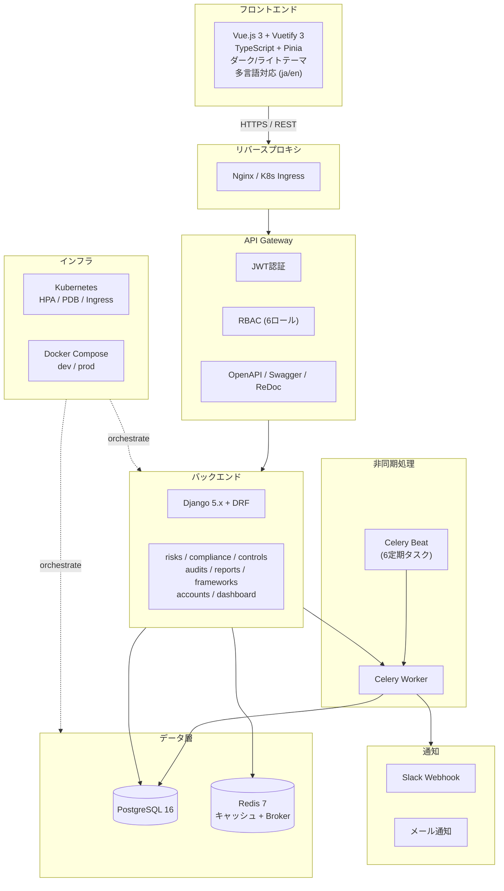
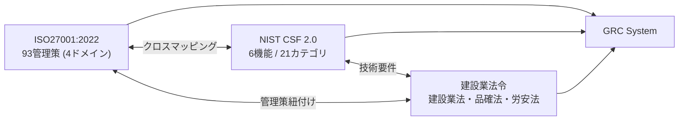
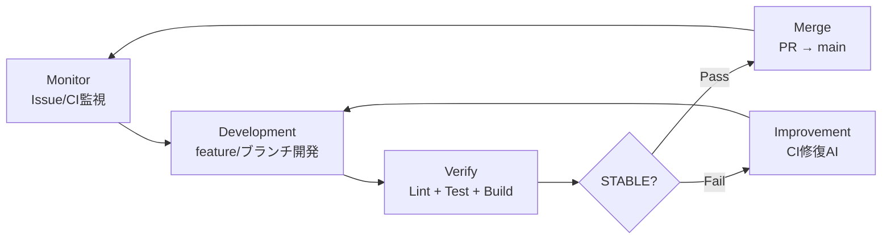

# Construction-GRC-System

## 建設業 統合リスク＆コンプライアンス管理システム

[](https://github.com/Kensan196948G/Construction-GRC-System/actions)
[](https://www.python.org/)
[](https://vuejs.org/)
[](LICENSE)
[](#-準拠規格)
[](#-準拠規格)

---

## 開発状況

| Phase | 内容 | 状態 |
|:-----:|------|:----:|
| Phase 1 | Django基盤 + JWT認証 + RBAC | 完了 |
| Phase 2 | マイグレーション + UI強化 + Celery + 監査ログ | 完了 |
| Phase 3 | フレームワークAPI + RBAC拡充 + UI3画面完全実装 | 完了 |
| Phase 3.5+4 | テスト強化 + インフラ本番化 + 統合ダッシュボードAPI + PDFレポート生成 | 完了 |
| Phase 5 | 外部連携 + ダークテーマ + セキュリティ強化 + OpenAPI | 完了 |
| Phase 6 | Redis + N+1最適化 + 監査自動化 + K8s + Slack + OWASP + i18n | 完了 |
| Phase 7 | 本番品質仕上げ (Dashboard統合 + Settings + テスト改善) | 完了 |
| Phase 8 | CSVエクスポート + ファイルアップロード + アクティビティログ + Releases自動化 | 完了 |
| Phase 9 | 最終仕上げ (v1.0.0 リリース) | ✅ 完了 |
| Phase 10A | 品質強化 — Docker統合テスト + Playwright E2E + カバレッジゲート | ✅ 完了 (PR #44) |
| Phase 10B | 機能拡張 — TOTP 2FA本格実装 + レポートスケジュール機能 | ✅ 完了 (PR #45) |
| Phase 10C | インフラ — K8s設定スクリプト + パフォーマンスベンチマーク | ✅ 完了 (PR #46) |
| Phase 11 | ScheduledReport Celery Beat + TOTP 2FA UI + モバイル対応 | ✅ 完了 (PR #48/#49) |

| 指標 | 値 |
|------|-----|
| CI状態 | [](https://github.com/Kensan196948G/Construction-GRC-System/actions) |
| バージョン | v1.2.0 (Phase 11 完了) |
| STABLE マージ数 | 50 PRs |
| テスト数 | 660+ ケース |
| 最終更新 | 2026-04-08 |

---

## プロジェクト概要

**Construction-GRC-System** は、建設業向けの統合GRC（Governance, Risk, Compliance）管理基盤です。

| 項目 | 内容 |
|------|------|
| 目的 | 多法令・多規格対応の統合GRC管理 |
| 情報セキュリティ | ISO27001:2022 全93管理策（4ドメイン） |
| サイバーセキュリティ | NIST CSF 2.0（6機能 / 21カテゴリ） |
| 法令準拠 | 建設業法・品確法・労安法 |
| 利用者 | GRC管理者・リスクオーナー・監査員・経営層（約50名） |
| 監査工数削減 | 年間500時間 → 自動化目標 |

---

## アーキテクチャ

### システム全体構成



### フレームワーク関係図



---

## 技術スタック

| カテゴリ | 技術 | バージョン |
|----------|------|-----------|
| Backend | Python + Django + DRF | 3.12 / 5.x / 3.15 |
| Frontend | Vue.js + TypeScript + Vuetify | 3.x / 5.x / 3.x |
| DB | PostgreSQL | 16 |
| Cache / Broker | Redis | 7 |
| Task Queue | Celery + Beat | 5.x |
| Container | Docker / Docker Compose | 24+ / 2.20+ |
| Orchestration | Kubernetes (HPA / PDB / Ingress) | 1.28+ |
| CI/CD | GitHub Actions | - |
| 認証 | djangorestframework-simplejwt + pyotp | JWT + TOTP 2FA |
| レポート | openpyxl / WeasyPrint | Excel / PDF |
| チャート | Chart.js / ECharts | - |
| API Docs | drf-spectacular | OpenAPI 3.0 |
| E2E テスト | Playwright | - |
| パフォーマンス | locust | 負荷テスト |

---

## 機能一覧

| 機能 | 説明 |
|------|------|
| JWT認証 + RBAC | 6ロール（GRC管理者・リスクオーナー・コンプライアンス担当・監査員・経営層・一般） |
| リスク管理 | リスクレジスター・5x5ヒートマップ・ダッシュボード・残存リスクモニタリング |
| コンプライアンス管理 | 7法令フレームワーク対応・準拠率ダッシュボード・証跡管理 |
| ISO27001 全93管理策 | 適用宣言書(SoA)自動生成・4ドメイン管理（組織的37/人的8/物理的14/技術的34） |
| NIST CSF 2.0 | 6機能（GOVERN/IDENTIFY/PROTECT/DETECT/RESPOND/RECOVER）・21カテゴリ |
| 内部監査管理 | 年間監査計画・監査所見(重大/軽微/観察)・是正処置(CAP)追跡 |
| 監査ワークフロー自動化 | ステータス遷移（計画中→実施中→レビュー→完了→クローズ）・期限超過CAP検出 |
| 統合GRCダッシュボード | リスク・コンプライアンス・監査の統合ビュー・KPI表示 |
| PDFレポート生成 | ISO27001年次レポート・リスクレポート・監査レポート等のPDFエクスポート |
| Webhook / Slack / メール通知 | リスク変更・監査期限・コンプライアンス違反の通知 |
| ダーク / ライトテーマ切替 | Vuetify 3 ベースのテーマ切替対応 |
| 多言語対応 (i18n) | 日本語 / English 切替 |
| OWASP Top 10 セキュリティ対応 | セキュリティヘッダ・CSRF・XSS・SQLi対策 |
| Kubernetes 本番デプロイ | HPA / PDB / Ingress / ConfigMap / Secret 完備 |
| Redis キャッシュ + N+1最適化 | APIレスポンスキャッシュ・select_related / prefetch_related 最適化 |
| 経審P点計算 | 経営事項審査P点の自動計算 |
| Celery定期タスク | 6タスク（リスク再評価・コンプライアンスチェック・期限通知・レポート生成等） |
| OpenAPI / Swagger / ReDoc | APIドキュメント自動生成 |
| 📥 CSVエクスポート | 全モデル CSV/Excel 対応エクスポート |
| 📎 ファイルアップロード | ISO27001 証跡管理（エビデンスファイル添付） |
| 📜 アクティビティログ | 変更履歴の記録・表示 |
| 🏷 GitHub Releases自動化 | タグプッシュ時の自動リリース作成 |
| 🔐 TOTP 2FA | TOTP準拠の二要素認証 (QRコード設定 / ワンタイムパスワード検証) |
| 📅 レポートスケジュール | 定期レポート自動生成 (日次/週次/月次, 複数宛先メール配信) |
| 🐳 Docker統合テスト | `SKIP_DOCKER_INTEGRATION=1` でCI環境スキップ可能な統合テストスイート |
| 📊 パフォーマンスベンチマーク | locust によるAPI負荷テスト (10ユーザー / 60秒 / ヘッドレス実行) |

---

## 開発フロー



---

## ディレクトリ構成

```
Construction-GRC-System/
├── backend/                  # Django バックエンド
│   ├── grc/                  #   プロジェクト設定 (settings, urls, wsgi)
│   ├── apps/                 #   Django アプリケーション
│   │   ├── accounts/         #     JWT認証 + RBAC + ユーザー管理
│   │   ├── risks/            #     リスク管理
│   │   ├── compliance/       #     コンプライアンス管理
│   │   ├── controls/         #     ISO27001管理策 + NIST CSF
│   │   ├── audits/           #     内部監査 + 所見管理 + ワークフロー
│   │   ├── frameworks/       #     フレームワーク定義
│   │   └── reports/          #     レポート生成 (PDF / Excel)
│   └── tests/                #   テスト (517+ ケース)
├── frontend/                 # Vue.js 3 フロントエンド
│   └── src/
│       ├── components/       #   UI コンポーネント
│       ├── views/            #   9画面 (Dashboard / Risk / Compliance / Audit / Controls / Reports / Settings / Frameworks / ActivityLog)
│       ├── composables/      #   テーマ・多言語・API フック
│       └── i18n/             #   多言語リソース (ja / en)
├── k8s/                      # Kubernetes マニフェスト
│   ├── namespace.yaml        #   grc-system namespace
│   ├── configmap.yaml        #   環境設定
│   ├── secrets.yaml          #   シークレット
│   ├── backend-deployment.yaml
│   ├── frontend-deployment.yaml
│   ├── celery-deployment.yaml
│   ├── postgres-statefulset.yaml
│   ├── redis-deployment.yaml
│   ├── ingress.yaml          #   Ingress ルーティング
│   ├── hpa.yaml              #   水平Pod自動スケーリング
│   ├── pdb.yaml              #   Pod Disruption Budget
│   └── kustomization.yaml    #   Kustomize 統合
├── e2e/                      # E2E テスト (Playwright)
│   ├── tests/                #   テストスイート
│   └── playwright.config.ts  #   Playwright 設定
├── docs/                     # ドキュメント (10カテゴリ)
├── scripts/                  # 自動化スクリプト
├── .github/workflows/        # GitHub Actions CI/CD
├── Makefile                  # 開発コマンド
├── docker-compose.yml        # Docker Compose (開発)
├── docker-compose.prod.yml   # Docker Compose (本番)
├── pyproject.toml            # Python プロジェクト設定
├── CHANGELOG.md              # 変更履歴
└── VERSION                   # バージョンファイル
```

---

## セットアップ・コマンド

### クイックスタート (開発環境)

```bash
git clone https://github.com/Kensan196948G/Construction-GRC-System.git
cd Construction-GRC-System
make setup          # venv作成 + 依存インストール + .env生成
make migrate        # DBマイグレーション
make fixtures       # ISO27001(93) + NIST CSF(21) + 建設業法令(17) 投入
make dev-backend    # http://localhost:8000
make dev-frontend   # http://localhost:3000
```

### Docker Compose (開発)

```bash
make docker-up      # docker-compose.yml で起動
make docker-down    # 停止
```

### Docker Compose (本番)

```bash
docker compose -f docker-compose.prod.yml up -d    # 本番構成で起動
docker compose -f docker-compose.prod.yml down      # 停止
```

### Kubernetes デプロイ

```bash
kubectl apply -k k8s/   # Kustomize で全リソース適用
```

### Makefile コマンド一覧

| コマンド | 説明 |
|----------|------|
| `make setup` | 初期セットアップ（venv + 依存 + .env） |
| `make migrate` | DBマイグレーション |
| `make fixtures` | フィクスチャデータ投入（131レコード） |
| `make dev-backend` | バックエンド開発サーバー起動 |
| `make dev-frontend` | フロントエンド開発サーバー起動 |
| `make test` | バックエンドテスト |
| `make test-cov` | カバレッジ付きテスト |
| `make lint` | Ruff + Black チェック |
| `make lint-fix` | 自動修正 |
| `make build` | フロントエンドビルド |
| `make docker-up` | Docker Compose 起動 |
| `make docker-down` | Docker Compose 停止 |

### 管理コマンド

| コマンド | 説明 |
|----------|------|
| `python manage.py load_frameworks` | フレームワークデータ一括ロード |
| `python manage.py seed_sample_data` | 開発用サンプルリスク10件投入 |
| `python manage.py createsuperuser` | 管理者ユーザー作成 |

---

## API エンドポイント

### 認証 (`/api/v1/auth/`)

| メソッド | パス | 説明 |
|:--------:|------|------|
| POST | `/api/v1/auth/token/` | JWTトークン取得 |
| POST | `/api/v1/auth/token/refresh/` | トークンリフレッシュ |
| GET | `/api/v1/auth/profile/` | ユーザープロフィール |
| GET | `/api/v1/auth/users/` | ユーザー一覧 |
| POST | `/api/v1/auth/2fa/setup/` | 🔐 TOTP 2FA設定 (QRコード + シークレット発行) |
| POST | `/api/v1/auth/2fa/verify/` | 🔐 TOTP 2FA有効化 (初回ワンタイムパスワード検証) |
| POST | `/api/v1/auth/2fa/disable/` | 🔐 TOTP 2FA無効化 |

### 統合ダッシュボード (`/api/v1/dashboard/`)

| メソッド | パス | 説明 |
|:--------:|------|------|
| GET | `/api/v1/dashboard/` | GRC統合ダッシュボード（リスク・コンプライアンス・監査KPI） |

### リスク管理 (`/api/v1/risks/`)

| メソッド | パス | 説明 |
|:--------:|------|------|
| GET/POST | `/api/v1/risks/` | リスク一覧 / 作成 |
| GET/PUT/DELETE | `/api/v1/risks/{id}/` | リスク詳細 / 更新 / 削除 |
| GET | `/api/v1/risks/heatmap/` | リスクヒートマップ |
| GET | `/api/v1/risks/dashboard/` | リスクダッシュボード |
| GET | `/api/v1/risks/export/csv/` | リスク一覧CSVエクスポート |
| GET | `/api/v1/risks/export/excel/` | リスク一覧Excelエクスポート |

### コンプライアンス (`/api/v1/compliance/`)

| メソッド | パス | 説明 |
|:--------:|------|------|
| GET/POST | `/api/v1/compliance/` | コンプライアンス要件一覧 / 作成 |
| GET/PUT/DELETE | `/api/v1/compliance/{id}/` | 要件詳細 / 更新 / 削除 |
| GET | `/api/v1/compliance/compliance-rate/` | 準拠率 |
| GET | `/api/v1/compliance/export/csv/` | コンプライアンス要件CSVエクスポート |
| GET | `/api/v1/compliance/export/excel/` | コンプライアンス要件Excelエクスポート |

### ISO27001 管理策 (`/api/v1/controls/`)

| メソッド | パス | 説明 |
|:--------:|------|------|
| GET/POST | `/api/v1/controls/` | 管理策一覧 / 作成 |
| GET/PUT/DELETE | `/api/v1/controls/{id}/` | 管理策詳細 / 更新 / 削除 |
| GET | `/api/v1/controls/soa/` | 適用宣言書(SoA) |
| GET | `/api/v1/controls/compliance-rate/` | 管理策準拠率 |
| GET/POST | `/api/v1/controls/nist-csf/` | NIST CSF カテゴリ一覧 / 作成 |
| GET/PUT/DELETE | `/api/v1/controls/nist-csf/{id}/` | NIST CSF 詳細 / 更新 / 削除 |
| GET | `/api/v1/controls/export/csv/` | 管理策CSVエクスポート |
| GET | `/api/v1/controls/export/excel/` | 管理策Excelエクスポート |
| GET/POST | `/api/v1/controls/evidences/` | 証跡一覧 / アップロード |
| GET/PUT/DELETE | `/api/v1/controls/evidences/{id}/` | 証跡詳細 / 更新 / 削除 |

### 内部監査 (`/api/v1/audits/`)

| メソッド | パス | 説明 |
|:--------:|------|------|
| GET/POST | `/api/v1/audits/` | 監査一覧 / 作成 |
| GET/PUT/DELETE | `/api/v1/audits/{id}/` | 監査詳細 / 更新 / 削除 |
| POST | `/api/v1/audits/{id}/transition/` | 監査ステータス遷移 |
| GET/POST | `/api/v1/audits/findings/` | 監査所見一覧 / 作成 |
| GET/PUT/DELETE | `/api/v1/audits/findings/{id}/` | 所見詳細 / 更新 / 削除 |
| GET | `/api/v1/audits/overdue-caps/` | 期限超過CAP一覧 |
| GET | `/api/v1/audits/upcoming-caps/` | 期限間近CAP一覧 |
| GET | `/api/v1/audits/activity-logs/` | 変更履歴（アクティビティログ） |

### レポート (`/api/v1/reports/`)

| メソッド | パス | 説明 |
|:--------:|------|------|
| GET/POST | `/api/v1/reports/` | レポート一覧 / 作成 |
| GET/PUT/DELETE | `/api/v1/reports/{id}/` | レポート詳細 / 更新 / 削除 |
| POST | `/api/v1/reports/generate/risk/` | リスクレポートPDF生成 |
| POST | `/api/v1/reports/generate/compliance/` | コンプライアンスレポートPDF生成 |
| POST | `/api/v1/reports/generate/audit/` | 監査レポートPDF生成 |
| POST | `/api/v1/reports/generate/iso27001/` | ISO27001年次レポートPDF生成 |
| GET/POST | `/api/v1/reports/scheduled/` | 📅 定期レポートスケジュール一覧 / 作成 |
| GET/PUT/DELETE | `/api/v1/reports/scheduled/{id}/` | 📅 スケジュール詳細 / 更新 / 削除 |

### フレームワーク (`/api/v1/frameworks/`)

| メソッド | パス | 説明 |
|:--------:|------|------|
| GET/POST | `/api/v1/frameworks/` | フレームワーク一覧 / 作成 |
| GET/PUT/DELETE | `/api/v1/frameworks/{id}/` | フレームワーク詳細 / 更新 / 削除 |

### ヘルスチェック / APIドキュメント

| メソッド | パス | 説明 |
|:--------:|------|------|
| GET | `/api/health/` | DB / Redis 接続確認 |
| GET | `/api/docs/` | Swagger UI (OpenAPI) |
| GET | `/api/redoc/` | ReDoc (OpenAPI) |
| GET | `/api/schema/` | OpenAPI 3.0 スキーマ (YAML) |

---

## 直近の変更履歴

| PR | 内容 | 主要変更 |
|----|------|----------|
| #44 | 🔄 Phase 10A — 品質強化 | Docker統合テスト, Playwright E2E, Vitestカバレッジゲート60% |
| #45 | 🔄 Phase 10B — 機能拡張 | TOTP 2FA (pyotp), ScheduledReport (日次/週次/月次) |
| #40 | Phase 9 — v1.0.0 リリース (最終仕上げ) | README/CHANGELOG最終版, STABLE 2/2 |
| #38 | Phase 8 — CSVエクスポート + 証跡アップロード + アクティビティログ + Releases自動化 | CSV/Excel全モデル対応, 証跡ファイル管理, 変更履歴UI, GitHub Releases |
| #33 | Phase 7完結 — Dashboard統合 + Settings + テスト大幅改善 | 統合ダッシュボード, 設定画面, テスト517+ケース |
| #32 | Phase 6完結 — K8s + Slack通知 + OWASP監査 + 多言語対応 | K8sマニフェスト14ファイル, Slack Webhook, OWASP対策, i18n |
| #31 | Phase 6 — Redisキャッシュ + N+1最適化 + 監査ワークフロー + E2E拡充 | Redis導入, select_related最適化, 監査5ステータス遷移, Playwright E2E |
| #17 | Phase 5 — 外部連携 + UI品質 + セキュリティ + ドキュメント | ダークテーマ, OpenAPI/Swagger, セキュリティヘッダ |
| #16 | Phase 3.5+4 — テスト大幅追加 + インフラ本番化 + ダッシュボードAPI + PDF | docker-compose.prod.yml, Dashboard API, PDF生成, テスト倍増 |
| #15 | Phase 3 — フレームワークAPI + RBAC拡充 + UI3画面完全実装 + CI厳格化 | ESLint v9対応, Black/isort統一, Ruff全修正, README全面更新 |
| #14 | Phase 2 — 初期マイグレーション全6アプリ + UI強化3画面 + APIテスト | マイグレーション追加, UI強化 |
| #13 | Celery定期タスク + 監査ログミドルウェア | 6タスク定義, 監査ログ自動記録 |
| #12 | 経営事項審査P点計算 + コンプライアンスチェッカー | 建設業法データ投入 |
| #11 | JWT認証基盤 — カスタムUser + RBAC + 認証API | 6ロール権限, トークン認証 |
| #10 | コード品質ハードニング | Lint修正, テスト追加 |

---

## 準拠規格

### ISO27001:2022

全93管理策を4ドメインで管理。

| ドメイン | 管理策数 | 範囲 |
|----------|:--------:|------|
| 組織的管理策 | 37 | A.5.1 〜 A.5.37 |
| 人的管理策 | 8 | A.6.1 〜 A.6.8 |
| 物理的管理策 | 14 | A.7.1 〜 A.7.14 |
| 技術的管理策 | 34 | A.8.1 〜 A.8.34 |

### NIST CSF 2.0

6機能・21カテゴリによるサイバーセキュリティフレームワーク。

| 機能 | 説明 |
|------|------|
| GOVERN (GV) | ガバナンス -- 組織の方針・リスク戦略 |
| IDENTIFY (ID) | 識別 -- 資産・リスクの把握 |
| PROTECT (PR) | 防御 -- アクセス制御・データ保護 |
| DETECT (DE) | 検知 -- 異常・イベントの監視 |
| RESPOND (RS) | 対応 -- インシデント対応計画 |
| RECOVER (RC) | 復旧 -- 復旧計画・改善 |

### 建設業関連法令

| 法令 | 管轄 | 対象 |
|------|------|------|
| 建設業法 | 経営管理部 | 許可条件・経審・下請契約 |
| 品確法 | 工事部門 | 品質管理・技術継承 |
| 労安法 | 安全管理部 | 現場安全管理・労災防止 |

---

## ライセンス

[MIT License](LICENSE)

---

<div align="center">

**Construction-GRC-System**
*Building Compliance, Managing Risk, Ensuring Governance*

</div>
